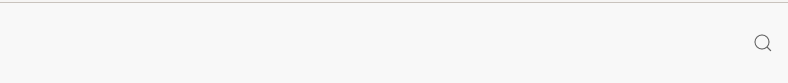
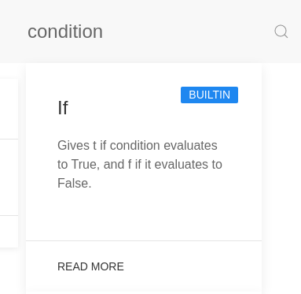
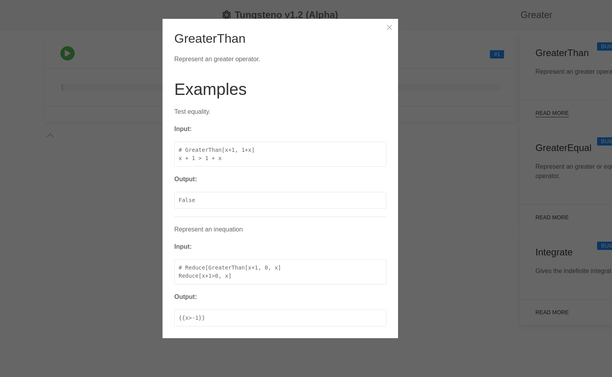

## Changelog

- Added a search engine that searches for available functions, and shows you information about them.
  - Integrated in the UI.
  - Fuzzy function finder, searching on function name and description.
  - Only English support.
- Added a modal with more detailed information on the functions.
- All default functions documented.
- Added docs.tungsten.app document generation to the main development branch.

## Screenshots

## Test it! (Download it!)

I am working on a simplified installation method available for all operating systems. Right now, there is no executable available to download and install directly. However, Tungsten has a Docker version available, which you can run directly. You can also run it from the repository, or from the demo link:

[demo.tungsteno.app](https://demo.tungsteno.app)
